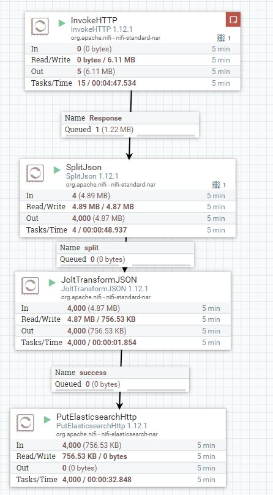
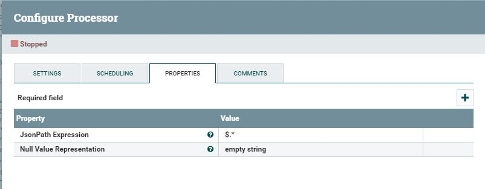
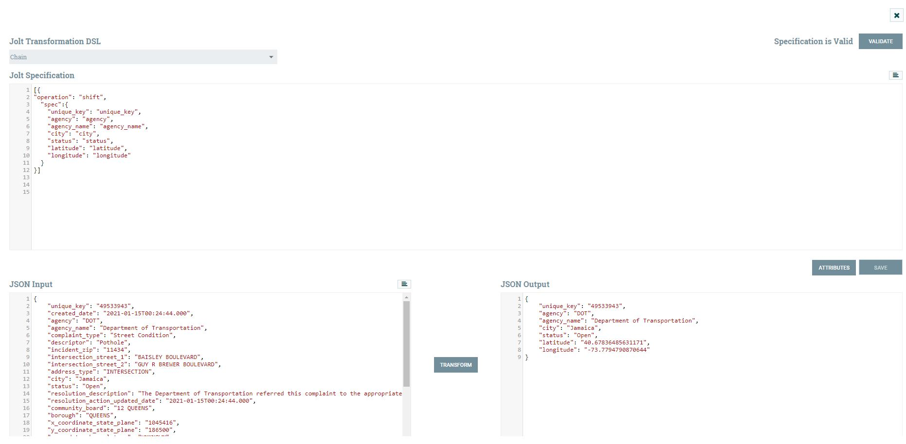
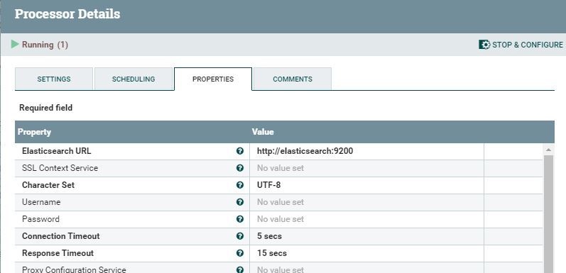
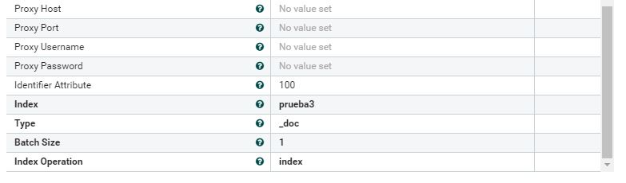
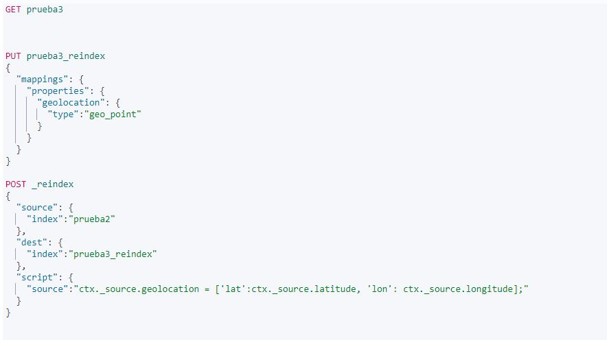
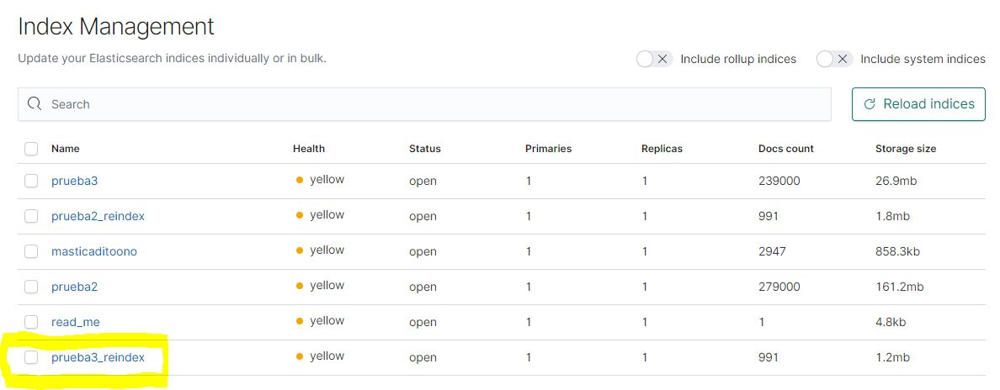
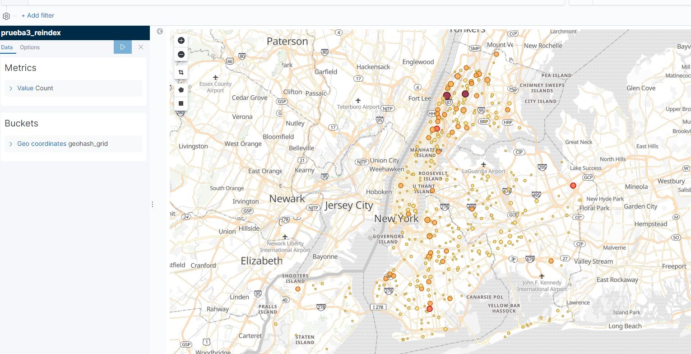

# Ejercicio Nifi+ELK 
- Profesor :   [Pedro Nieto](https://github.com/a10pepo)
- Estudiante:      [Jordi Oltra](https://github.com/20rd1)

### Enunciado

```
Usando nifi+ELK, debéis presentar una solución que muestre, sobre un mapa, 
la disposición de delitos presentes en esta API:
https://data.cityofnewyork.us/Social-Services/311-Service-Requests-from-2010-to-Present/erm2-nwe9
```

#### Paso 1: Preparar un docker-compose con estos contenedores: 

| Component | Port |
| --- | --- | 
| Kibana | 5601 |
| Elasticsearch | 9200 |
| Nifi | 8080 |

#### Paso 2: Procesadores en Nifi 
Invokehttp: Para la ingesta de los datos/
SplitJSON: Para separar todas las listas de datos/
JoltTransformJSON: Para seleccionar los datos que se van a mandar/
Putelasticsearchhttp: Para mandar los datos a elasticsearch

Imagen  del esquema de Nifi

Configuración Invokehttp: 

Configuración SplitJSON:

Configuración JoltTransformJSON:

Configuración Putelasticsearchhttp:




##### Paso 4: Comprobar si se han traido los datos de Nifi y crear una columna de tipo geo_point




##### Paso 5: Comprobar si prueba3_reindex esta dentro de elasticsearch 



##### Paso 6:Representar en Kibana los datos de la variable tipo geo_point.



